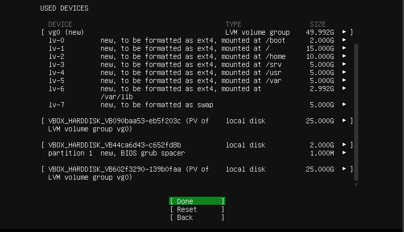

<!--markdownlint-disable MD013-->
# Systems

Preface

The design of the software is subject to change, so use common sense and know that Google is Your best friend.

## Environment

Virtualization Clients

Whoa, whoa, whoa, don't You forgot to download [Ubuntu Server] LTS iso?... Good for You.

### VirtualBox Set up

Download VirtualBox:

- Visit the official VirtualBox website at https://www.virtualbox.org/.
- Navigate to the "Downloads" section.
- Choose the version of VirtualBox that corresponds to Your host operating system (e.g., Windows, macOS, Linux, etc.).
- Click on the download link to start the download of the VirtualBox installer.

And now You (probably) can run virtualbox, by windows search bar (WIN + Q and type in "VirtualBox" and click on "Oracle VM VirtualBox").

Virtual Machine set up:

- Click on the "Quick create..." in the tools panel.
- Enter the name of the virtual machine.
- In the text box with the "ISO Image" name, enter the path to the .iso file.
- Check the box next to "Skip Unattended Instalation".
- And click finish.

To configure the virtual machine, just right-click on it and select "Settings".

To start the virtual machine, just right-click on it and select "Start -> Normal Start".

To turn off the virtual machine, just right-click on it and select "Stop -> Power Off".

You're done (need to celebrate with a NOT very large piece of cake)!

### Hyper-V Set up

First, You are obligated to have windows (10|11) pro.

- Open the "Control Panel" on Your Windows machine.
- Go to "Programs" -> "Programs and Features" -> "Turn Windows features on or off."
- Scroll down and find "Hyper-V."
- Check the box next to "Hyper-V" and click "OK."
- Windows will prompt You to restart Your computer. Save Your work and restart.

And now You (probably) can run Hyper-v, by windows search bar (WIN + Q and type in "Hyper-v" and click on "Hyper-v Manager").

Virtual Machine set up:

- Select a server, it can be Your computer or another machine You can connect to. The list of (currently) available servers is displayed in the left panel.
- Click on the "Quick create..." in the right panel.
- In the pop-up window, click on "_Local installation source".
- Uncheck the box next to "Windows Secure Boot."
- And select the .iso file on your local storage via button "Change installation source".
- That blue-filled button with "Create Virtual Machine" on it beckons you, and you press it with an irresistible urge.

To configure the virtual machine, just right-click on it and select "Settings".

To start the virtual machine, just right-click on it and select "Start".

To turn off the virtual machine, just right-click on it and select "Turn off".

You're done (need to celebrate with a very large piece of cake)!

Ubuntu Server Installation

Since I am not obliged to explain all the steps of the installation..., good luck!

### Partitioning in the installer

On the storage configuration page:

- Choice the drive that will be used as boot device.
- Press enter when you choice the drive name and select: "Use As Boot Device".
- For a healthy and proper Linux installation you should create: root ('/'), home ('/home') and boot ('/boot') partitions.
- Select free space point (under the drive name) and click on "Add GPT Partition".
- Specify the size of the partition space.
- Select the "Mount" You want it to be.

After all Mounts get created with proper size, you're done with that section.

### Partitioning using LVM (Logical Volume Manager)

Soooo, why again You should make life more difficult for yourself and use LVM?
Ah, yeah, how can i forgor, to:

- Increase flexibility - You can easily add more space to an existing volume by adding a new drive to the group.
- Improve performance - You can spread data between drives, so also spread the reading of that data.
- Make the system more fault tolerance - create a mirroring for the logical volume (space - 20G, but you can use as user only 10G).

To start use LVM:

- Select "Create volume group".
- Check the devices You want to be in the group and click create.
- And after that You can use the free space of the group to create partitions like in section above.

### Swap space

We all get hungry from time to time.
The operating system is no exception, so we need to provide it with a special place from which it can draw memory when it runs out of RAM.
That's what the swap space is made for.

So to specify the swap space:

- From the free space, select - "Create volume group".
- Specify the size of the swap space
- In the section "Format", choice - "swap".

And that's all You need to create swap space.

### Example Storage Configuration

To run machine the drive with grub should be on the first sata port (sata 0).

Operations on Virtual Machine

### Network Configuration

To specify the network adapter:
  
- Right-click on VM and select "Settings".
- In the left panel select "Network".
- Make the "Enable Network Adapter" checked.
- Select the type of adapter ("Attached to..."): NAT, Bridge, Hostonly.

The difference between them is that:

- Hostonly: VM has no access to the internet, so only host can access it.
- Nat: the VM can be accessed only from the local network.
- Bridge: any machine on the internet can access the VM.

### Creating a clone of the system

To create a clone:

- Right-click on VM.
- Select "Clone...".
- Name it and give the place for this clone.
- Decide if you want to keep MAC addresses for network adapters or genrerate new ones.

It's your first clone (for this guide at least)!

### Creating a snapshots

To create a snapshot:

- On the right side of the VM board click on 3-dot menu.
- Select the "Snapshots" point.
- Click "Take" on the tools bar on the top.

It's your first snapshot (for this guide at least)!

### Clone vs Snapshots

If the options to clone and make snapshot literally do the same thing,
then why do we have these options?

Snapshots are less large in space than clones because they are incremental copies of a virtual machine's state.
This means that they only store the changes that have been made to the virtual machine since the last snapshot was created.

But clones in exange can be transferred from one machine to another.

## Basics of Linux system

Essential Linux Skills

- [ ]  **First login to the shell**
- [ ]  **Command line help**
- [ ]  **Services and processes**
- [ ]  **Files and file systems**
- [ ]  **Permissions**
- [ ]  **Identity and Access Control**
  - [ ] users
  - [ ] groups
  - [ ] ownership
  - [ ] rights
- [ ]  **Metadata Management**
  - [ ] size
  - [ ] space
  - [ ] date
  - [ ] time
- [ ]  **File Interaction**
  - [ ] read
  - [ ] search
  - [ ] copy
  - [ ] edit
  - [ ] delete

System Administration

- [ ] **Useful Linux system tools**
  - [ ] top
  - [ ] htop
  - [ ] netstat
  - [ ] Terminator
  - [ ] tmux
- [ ] **Console editors**
  - [ ] vim
  - [ ] nano (optional)
  - [ ] neovim
- [ ] **sudo command**
- [ ] **Users operations**
  - [ ] creating users
  - [ ] creating groups
  - [ ] deleting users
  - [ ] deleting groups
  - [ ] managing users passwords
- [ ] **Aliases**
- [ ] **Package management**
  - [ ] YUM
  - [ ] RPM
  - [ ] APT
  - [ ] APT-GET
  - [ ] DPKG
  - [ ] DEB
- [ ] **Compiling from source**
- [ ] **Space management**
- [ ] **Drives and partitions**
- [ ] **Creating ext4 file system and permanently mounting (Tworzenie systemu plików ext4 i montowanie stałe)**
- [ ] **Managing logical volumes**
- [ ] **NFS service**
  - [ ] server
  - [ ] client
  - [ ] fstab
- [ ] **System monitoring**

Networking

- [ ] **Network configuration**
- [ ] **SSH service**
  - [ ] client configuration
  - [ ] server configuration
  - [ ] tunneling
  - [ ] SCP
- [ ] **Networks and firewalls**
- [ ] **File Hosts and hostname**
- [ ] **Configuring interfaces using nmtui**
- [ ] **Firewall**
- [ ] **Assigning multiple IP addresses to network interfaces**
- [ ] **Monitoring traffic using tcpdump**

Remote Access

- [ ] **SSH**
  - [ ] putty
  - [ ] mremoteNG
  - [ ] MobaXtrem
- [ ] **VNC (optional)**

## HeLp

HELP! | POMOCY! | ПАМАХИТЕ! | HILFE! | ヘルプ！ | ¡AYÚDAME MI AMIGO!

### HELP

If you are not familiar with the English.... hold on, why you even reading that then?

### POMOCY

Jeśli nie jesteś zaznajomiony z angielskim, cóż, użyj [deepl], jest chyba wystarczająco dobry...?

### ПАМАХИТЕ

Они держат меня в этом межгалактическом подвале уже третий день по каленадрю Юпитера, вызовите бригаду космического десанта [deepl], они должны знать что делать в таких ситуациях, наверное ...?

### HILFE

Wenn Sie mit der englischen Sprache nicht vertraut sind, verwenden Sie [deepl], das ist wahrscheinlich gut genug, nehme ich an...?

### ヘルプ

英語に馴染みがなければ、[deepl]を使えばいい。

### AYÚDAME MI AMIGO

¿Si no estás familiarizado con el inglés, bueno, utiliza [deepl], supongo que te servirá...?

[deepl]: <https://www.deepl.com/>
[Ubuntu Server]: <https://ubuntu.com/download/server>
