# Systems

<details>
<summary>Preface</summary>

The design of the software is subject to change,
so use common sense and know that Google is Your best friend.

</details>

***

## Environment

<details>
<summary>Virtualization Clients</summary>

Whoa, whoa, whoa, don't You forgot to download [Ubuntu Server] LTS iso?...
Good for You.

### VirtualBox Set up

Download VirtualBox:

- Visit the official VirtualBox website at https://www.virtualbox.org/.
- Navigate to the `Downloads` section.
- Choose the version of VirtualBox that corresponds to Your host operating system
(e.g., Windows, macOS, Linux, etc.).
- Click on the download link to start the download of the VirtualBox installer.

And now You (probably) can run virtualbox,
by windows search bar (WIN + Q and type in `VirtualBox` and click on `Oracle VM VirtualBox`).

Virtual Machine set up:

- Click on the `Quick create...` in the tools panel.
- Enter the name of the virtual machine.
- In the text box with the `ISO Image` name, enter the path to the .iso file.
- Check the box next to `Skip Unattended Instalation`.
- And click finish.

To configure the virtual machine, just right-click on it and select `Settings`.

To start the virtual machine,
just right-click on it and select `Start -> Normal Start`.

To turn off the virtual machine,
just right-click on it and select `Stop -> Power Off`.

You're done (need to celebrate with a NOT very large piece of cake)!

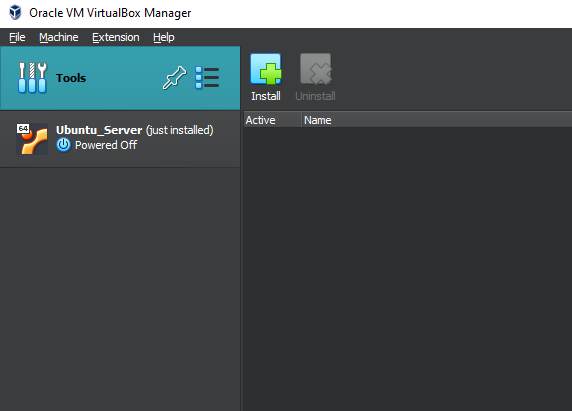

### Hyper-V Set up

First, You are obligated to have windows (10|11) pro.

- Open the `Control Panel` on Your Windows machine.
- Go to `Programs -> Programs and Features -> Turn Windows features on or off`.
- Scroll down and find `Hyper-V.`
- Check the box next to `Hyper-V` (and every subtree if windows is stupid)
and click `OK.`
- Windows will prompt You to restart Your computer. Save Your work and restart.

And now You (probably) can run Hyper-v,
by windows search bar (WIN + Q and type in `Hyper-v` and click on `Hyper-v Manager`).

Virtual Machine set up:

- Select a server,
it can be Your computer or another machine You can connect to.
The list of (currently) available servers is displayed in the left panel.
- Click on the `Quick create...` in the right panel.
- In the pop-up window, click on `_Local installation source`.
- Uncheck the box next to `Windows Secure Boot.`
- And select the .iso file on your local storage via button
`Change installation source`.
- That blue-filled button with `Create Virtual Machine` on it beckons you,
and you press it with an irresistible urge.

To configure the virtual machine, just right-click on it and select `Settings`.

To start the virtual machine, just right-click on it and select `Start`.

To turn off the virtual machine, just right-click on it and select `Turn off`.

You're done (need to celebrate with a very large piece of cake)!

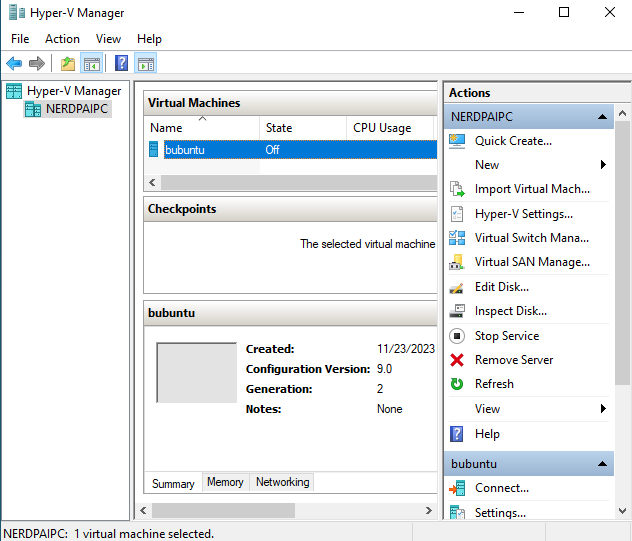

</details>

<details>
<summary>Ubuntu Server Installation</summary>

### Installation

1. After you start up your VM by first,
select `Try or Install Ubuntu`.
1. Choose the language, and believe me,
sooner than later but you will change
the language of your system to English anyway,
so do not create problems for your future self
and choose the language right away
(But just don't choose British English, remember -
"coloUr" is the most evil thing you can meet in your life.).
1. `Continue without updating`.
1. If I were you, I'd leave keyboard configuration
as default, so just `Done`.
1. This is just a virtual machine installation,
so I don't think you need any proprietary drivers.
`Done`.
1. Wait 5 seconds for configuration and ~~`DonDoDon` :pouting_cat:~~ `Done`.
1. Configure your proxy, or just `Done`.
1. Wait 5 second for configuration and `Done`.
1. Configure storage, or `Done`.
1. You have second chance to configure storage,
or just `Done`.
1. Then `Continue` if you want installation to begin.
1. And after installation is complete, just click `Enter`.

### Partitioning in the installer

On the storage configuration page:

- Choice the drive that will be used as boot device.
- Press enter when you choice the drive name and select: `Use As Boot Device`.
- For a healthy and proper Linux installation you should create:
root ('/'), home ('/home') and boot ('/boot') partitions.
- Select free space point (under the drive name) and click on `Add GPT Partition`.
- Specify the size of the partition space.
- Select the `Mount` You want it to be.

After all Mounts get created with proper size, you're done with that section.

### Partitioning using LVM (Logical Volume Manager)

Soooo, why again You should make life more difficult for yourself and use LVM?
Ah, yeah, how can i forgor, to:

- Increase flexibility - You can easily add more space to an existing volume
by adding a new drive to the group.
- Improve performance - You can spread data between drives,
so also spread the reading of that data.
- Make the system more fault tolerance - create a mirroring for the logical volume
(space - 20G, but you can use as user only 10G).

To start use LVM:

- Select `Create volume group`.
- Check the devices You want to be in the group and click create.
- And after that You can use the free space of the group to create partitions
like in section above.

### Swap space

We all get hungry from time to time.
The operating system is no exception,
so we need to provide it with a special place
from which it can draw memory when it runs out of RAM.
That's what the swap space is made for.

So to specify the swap space:

- From the free space, select - `Create volume group`.
- Specify the size of the swap space
- In the section `Format`, choice - `swap`.

And that's all You need to create swap space.

### Example Storage Configuration


To run machine the drive with grub should be on the first sata port (sata 0).

</details>

<details>
<summary>Operations on Virtual Machine</summary>

### Virtualbox

#### ***Network Configuration***

To specify the network adapter:
  
- Right-click on VM and select `Settings`.
- In the left panel select `Network`.
- Make the `Enable Network Adapter` checked.
- Select the type of adapter (`Attached to...`): NAT, Bridge, Hostonly.

The difference between them is that:

- Hostonly: VM has no access to the network, so only host can access it.
- Nat: the VM can be accessed only from the local network.
- Bridge: any machine on the internet can access the VM.

#### ***Creating a clone of the system***

To create a clone:

- Right-click on VM.
- Select `Clone...`.
- Name it and give the place for this clone.
- Decide if you want to keep MAC addresses for
network adapters or genrerate new ones.

It's your first clone (for this guide at least)!

#### ***Creating a snapshots***

To create a snapshot:

- On the right side of the VM board click on 3-dot menu.
- Select the `Snapshots` point.
- Click `Take` on the tools bar on the top.

It's your first snapshot (for this guide at least)!

### Hyper-v

#### ***Network-adapter Configuration***

To specify the network adapter:
  
- In the left panel `Virtual switch manager...`.
- And choice the type of switch:
external(bridge), internal(nat), private(hostonly).
- Then `OK`.
- Right-click on VM, `Settings...`.
- In hardware section, `Add hardware`.
- Select `Network adapter` and then `add`.
- Click on the adapter
- In drop-down menu `virtual switch` select
the switch you created in point 2.

#### ***Export of the system***

To export (create a clone):

- Right-click on VM.
- Select `Export...`.
- Select where to export

#### ***Creating a checkpoints***

To create a checkpoint (snapshot):

- Right-click on VM.
- Select `Checkpoint`.

#### ***Microsoft specials***

~~Why the f**k you always tend to have your own naming...~~

### Clone vs Snapshots

If the options to clone and make snapshot literally do the same thing,
then why do we have these options?

Snapshots are less large in space than clones
because they are incremental copies of a virtual machine's state.
This means that they only store the changes
that have been made to the virtual machine since the last snapshot was created.

But clones in exange can be transferred from one machine to another.

</details>

***

## Basics of Linux system

<details>
<summary>Essential Linux Skills</summary>

<div style="margin-left: 20px;">
<details>
<summary>First login to the sHELL</summary>

### Lame way to log in

When your coolers start spinning,
the rgb lights play all sorts of hues
and the screen shows a mysterious picture.

Welcome to the user login screen!
It should show something like this:

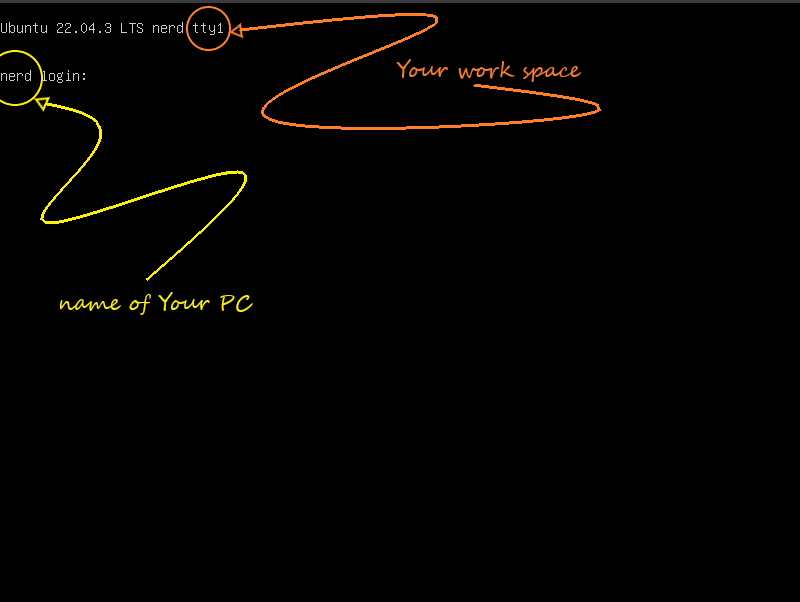

To log in,all you have to do is enter your login (username)
and then enter the most secret password the mind has ever had a chance to create.

And yes, that's all you had to do to complete this extremely hard subsection.

### Interesting way

Psst, psst, reader, do you like to remember passwords?

Yeah, me too. So why shouldn't we create additional login options?

You know, something like fido2, u2f security key,
or maybe we should use our own flesh for authentication?

First of all we must have some security authentication usb device.
It is a great pity that I do not have one.

In that case... We will use a simple usb drive!

We will use the [pam_usb] tool to achieve our destiny.

- Update the apt using `sudo apt update`.
- Install all packages form the instruction for `debian based` on [pam_usb].
- Also install make, gcc.
- Make `git clone 'link here'`.
- Move Yours current position to the pam_usb directory.
- Use `make` command.
- And `sudo make install`

All that's left to do is configure [pam_usb].

- Find the name of your us drive by `sudo fdisk -l`
- Find the name of user, who'll be log in by usb.
`getent passwd | awk -F: '$3 >= 1000 && $3 <= 60000 {print $1}'`
($3 = UID)
- Add the device using `sudo pamusb-conf --add-device YourDeviceName`
- And then user `sudo pamusb-conf --add-user YourUserName`
- The last task is to add our authentication method
so open file `/etc/pam.d/common-auth` via root
and add `auth sufficient pam_usb.so` to the top of the file.

The result of these efforts - will be a directory with a file on the drive:

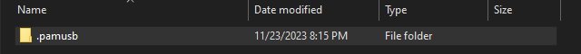

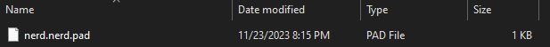

And the login process now looks something like this:

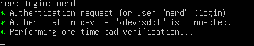


</details>

<details>
<summary>Command line help</summary>

In this cruel world of injustice and suffering,
ahem... in our beloved linux (and especially ubuntu),
You, my amigo, definitely need reliable friends!

### man

First thing that you should recall when you encounter problems
(especially dementia) - man. Just write `man 'your command'`
and if man have something to say you, he will show you
the help instruction.

### tldr

better man

### A bit of luck

No one is ever privy to such details, but,
if the developer has sufficient knowledge in the field of UX,
then you can try your luck and simply write a command
without parameters. And if the front side of the coin shows an eagle,
it is even possible to see how to get help or maybe help itself.

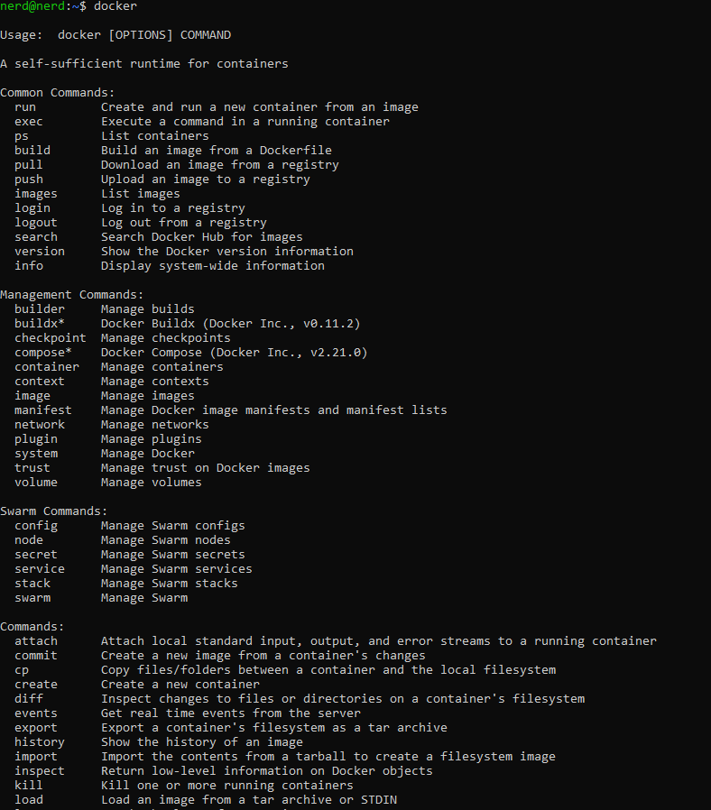

### Uncle Google

You are desperate?
Want to find an answer?
Even more, you would like to find complete solution?

It's time to experience full power of internet,
we are going to use browser!

But before,... docker instalation!

- sudo apt install apt-transport-https ca-certificates curl software-properties-common
- curl -fsSL https://download.docker.com/linux/ubuntu/gpg | sudo apt-key add -
- sudo add-apt-repository "deb [arch=amd64]
https://download.docker.com/linux/ubuntu $(lsb_release -cs) stable"
- sudo apt update
- sudo apt install docker-ce

And now, installation and first run of perfect gui browser:
`sudo docker run -ti browsh/browsh https://youtube.com`.

Here we are on the best site of tutorials!


*Mhm, youtube agreement, so..., I suppose*
*we just reject all of that. Aha, so i can't make any click*
*and tab also does not work...*

Solutions to this problem are not plentiful:

1. Connect to the our machine from the another machine with cursor.
1. Use keyboard-driven web-browser, e.g. elinks.

Personally, I prefer the first one.
But because the connection to the vm
is a separate point, you know where to find guide.

The result of our work is a beautiful and sharp vision of the internet:


</details>

<details>
<summary>Services and processes</summary>

### Processes

Most commonly used commands for processes,
definitely are: ps, kill, nice, and taskset.

#### ***ps***

ps — show a snapshot of current list of processes
(especially their pid).

`ps a` — to list entire list of processes.

#### ***kill***

kill — send a signal to a process.

`kill -KILL <PID>` — to kill the process
(similar to pkill).

`kill -STOP <PID>` — to stop the process.

`kill -CONT <PID>` — to continue the process.

#### ***nice***

nice — tool to change priority of process
(from -20 to 19)
(from max to min).

`nice --20 wget https://momcorp.com/playbot/hot-machines-without-secureboot.epub`
— this will execute this wget command (process) with the most high priority.

Or we can change nice index (usually in short - ni)
of the existant process — `sudo renice -n 5  -p 8721`.

Some notes:

- nice without sudo can set max 0 as ni.
- without sudo renice can only change
priority of the process to the lower value.

#### ***taskset***

We can assign a specific process to a specific CPU. So..., let's try it, I guess?

`taskset -p <PID>` — to show CPU affinity for the process.
E.g. return of the command 1f, that is equal to 00011111,
where the length of binary number if the number of the CPU,
and from the right to the left - attachment.
In this example process can be executed on:
CPU0, CPU1, CPU2, CPU3, CPU4.

To show the number of CPUs — `lscpu | grep ^CPU\\(s\\)`.

`taskset -p 0x5 <PID>` — assign CPU0, CPU2 to the process.

`taskset -c <CPU list> <PID>`.

`taskset -c 0,2 <PID>` — assign CPU0, CPU2 to the process

`taskset -c 0-2 <PID>` — assign CPU0, CPU1, CPU2 to the process

### Services

Linux users should be aware of certain service operations, such as:

- Enable service — `systemctl enable [--now] <Name of process>`
- Disable service — `systemctl disable [--now] <Name of process>`
- Start — `systemctl start <Name of process>`
- Stop — `systemctl stop <Name of process>`
- Restart — `systemctl restart <Name of process>`

</details>

<details>
<summary>Files and file systems</summary>

List of commands for this section: pwd, ls, cd, lsblk, mkfs.

#### ***pwd***

To show which directory you are currently in,
just type `pwd`

#### ***ls***

To show directory contents:

`ls` — shows all not hidden files and directories.

`ls -a` — shows all.

`ls -l` — like ls, but also shows size of the files,
their owners, permissions, last modification time.

#### ***cd***

To change your current possition — cd.

`cd <Path to the destination>`, path can be relative and global.

#### ***lsblk***

`lsblk -d` — show all drives.

`lsblk -d -o name,kname,fstype,size,type,rm,vendor,tran | grep -E 'usb|usb-c'` —
show only drives plugged by usb or usb-c.

#### ***mkfs***

`mkfs -t <Filesystem type> <Device name>` —
format the device with specific filesystem.

`mkfs.ext4 <Device name>` —
format the device with specific ext4 filesystem.

</details>

<details>
<summary>Permissions</summary>

File permissions in Linux dictate who can access a file
and how they can interact with it. They are represented
by a three-character sequence, commonly referred to as the `rwx` mode.

1. Read (r): Grants the ability to read the contents of a file.
1. Write (w): Allows the user to modify or change the contents of a file or directory.
1. Execute (x): Enables a user to execute a file,
which typically means running a program or viewing the contents of a directory.

These permissions are applied to three categories of users:

1. Owner: The user who created or owns the file.
1. Group: The group to which the file belongs.
1. Others: All other users on the system.

`chmod <options> <permissions> <file or directory>` — to change permissions.

`chmod 755 <path to the file>` — change premissions to the file.

`chmod -R 777 <path to the directory>` — change permissions to the directory
and its entire content.

</details>

<details>
<summary>Identity and Access Control</summary>

#### ***users***

Linux is a multi-user operating system,
meaning it can accommodate multiple users
with distinct identities and privileges.
Understanding the different user categories
and managing user accounts are essential aspects of Linux administration.

User Categories:

1. Root User: The ultimate administrative account with full control over the system.
1. System Users: Specialized accounts used by system services and applications.
1. Regular Users: Standard accounts granted to individuals for daily tasks.

Viewing All Users:

The `cat /etc/passwd` command displays a list of
all user accounts on the system. Each line contains information
about a single user, including their username, UID (user identifier),
GID (group identifier), home directory, and default shell.
To display only names, we can use: `awk -F':' '{ print $1}' /etc/passwd`.

In the most cases, to see users, you can log in,
the command `getent passwd | awk -F: '$3 >= 1000 && $3 <= 60000 {print $1}'`
will work just fine.

Identifying Login Users:

The `who` command lists all users currently logged into the system.
Each line displays the username, terminal name, login time,
and remote host from which the user logged in.

Switching Users:

To switch between user accounts without logging out,
use the su command followed by the username you want to switch to.
For example, to switch to the user netpai, use:
`su - netpai`.

#### ***groups***

Group Categories:

1. System Groups: Predefined groups used by system services and applications.
1. Primary Group: The default group to which a user belongs upon creation.
1. Secondary Groups: Additional groups a user can join for access control
and resource sharing.

Joining a Group:

To add a user to a group, use the `usermod` command followed by
the -g option for primary group or -G option for secondary groups:
`usermod [-g|-G] <group_name> <username>`

Removing from a Group:

To remove a user from a group, use the `gpasswd` command followed by the -d option:
`gpasswd -d <username> <group_name>`

Group Types:

1. Closed Groups: Membership requires explicit addition by an administrator.
1. Open Groups: Users can join or leave freely.
1. Nested Groups: Groups can be members of other groups,
creating a hierarchical structure.

Listing Groups:
`cat /etc/group`

#### ***ownership***

Linux utilizes two primary ownership levels:

- File Owner: The individual user who created or
has been explicitly assigned ownership of the file or directory.
- File Group: The group to which the file or directory belongs.
Users within this group may have specific permissions for the file or directory.

Change ownership:

`chown [options] <owner>:<group> <file or directory>`

`chown nerd:nerd .txt`

`chown -R nerd:nerd /home/nerd`

</details>

<details>
<summary>Metadata Management</summary>

#### ***size***

To check the size of a file or directory in Linux, you can use the
`du [options] <file or directory>`

Options:

`-h`: Human-readable format (e.g., KB, MB, GB)

`-s`: Summarize the total size for each argument

Usage:

`du <file>` — check the size of a file.

`du <directory>` — check the size of a directory.

`du -sh <directory>` — check the size of a directory in a readable format.

`du -s <directory>/*` — check the total size of all files in a directory.

`du -s <directory>**` — check the size of all files in a directory and its subdirectories.

#### ***space***

`df -h` — memory usage for mounts.

`free - h` — ram usage.

`du -sh $(find / -writable -user <user_name>)` — memory usage for the user

`du -sh $(find / -writable -group <group_name>)` — memory usage for the group

#### ***date & time***

`date` — to show date.

`sudo date -s <date>` — to set date.

</details>

<details>
<summary>File Interaction</summary>

#### ***read***

Go to the nano-vim section

#### ***search***

How original and no surprising at all, the command to search is called `find`.

More precisely: `find <path> [options] <criteria>`

`find <path> -name "file"` — find files by name.

`find <path> -type d` — find only directories

`find <path> -size +1M` — find all files greater then 1Mb.

As criteria can be used regex.

`find . -iregex '\.\/[a-z]+.md'` - find all files in current
directory that end by .md and have only characters before.

`fzf` - a lot better find.

#### ***copy***

`cp [options] <source> <destination>`

`cp <sFile> <dFile>` — for files.

`cp -R <sDirectory> <dDirectory>` — for directories.

#### ***rename & replace***

To rename or replace you can use — `mv`.

`mv [options] <source> <destination>`

`mv -p <sFile> <dFile>` — for files with preserving file attributes.

`mv -R <sDirectory> <dDirectory>` — for directories.

#### ***create***

Files:

`touch [options] <list of names or pathes>` — for file creation.

`touch t1 t2 t3` — create 3 files with prefix `t` in the current directory.

Directories:

`mkdir [options] <list of names or pathes>` — for directory creation.

`mkdir test` — create test directory in the current directory.

`mkdir -p ./test1/nested_test` — create nested_test directory in the current directory,
but also create all parent directories that does not exist.

#### ***info***

`file [options] <file path or name>` — short information about file.

`file t1`

`stat [options] <path or name>` — displays some useful information
about the object.

`stat t2`

`stat test1`

`exiftool [options] <path or name>` — one of the best metadata tool.

#### ***delete***

`rm [options] <source>`

`rm <sFile>` — for files.

`rm -R <sDirectory>` — for directories.

</details>

</div>

</details>

<details>
<summary>System Administration</summary>

<div style="margin-left: 20px;">

<details>
<summary>Useful Linux system tools</summary>

#### ***top***

top — interective and more complex then ps manager of processes.

`top -u root` — show all processes attached to the root.

#### ***htop***

:astonished: Is it a `top` but with a friendly design,
complex features and the ability to not only write commands in loop
but also `click` buttons?

#### ***netstat***

netstat is a powerful tool for network troubleshooting and monitoring.

`sudo apt install net-tools` — to install.

`netstat -a` — shows all conections.

`netstat -na` — shows all connections
without resolving names.

`netstat -nat` — shows tcp connections.

`netstat -r` — shows routing table.

`netstat -tn` — shows tcps where data transferring is active.

#### ***Terminator***

`sudo apt install terminator` — for installation.

since this is a gui application then we ought to install xvfb
for virtual monitor,.... good luck somehow display it!

#### ***tmux***

Just type `tmux` and you are in heaven.

All commands start with `ctrl + b`:

- `c` — create new window.
- `n or p` — move to the next ot previous window.
- `&` — kill current window.
- `% or `` — split current panel verticaly or horizontaly.
- `x` — close panel.
- `d` — exit from the tmux (and save it, somelike minimize).
- `:` — and then `kill-session` to exit and end process.

`tmux ls` — list sessions.

`tmux attach -t <number_of_the_session>` — return to the session.

</details>

<details>
<summary>Console editors</summary>


#### ***vim***

Literally less complex version of neovim.

#### ***nano***

It should be pre-installed. Just type `nano [options] <path_to_the_file>`

`nano -l <file>` — open the file and
displays the line number to the left of the text area.

When nano is opened, press: (ctrl/command) + W to show help.
And after you read this `tutorial`, my congratulations,
you mastered nano.

#### ***neovim***

History evolution:
vi -> vim -> neovim.

`sudo apt install neovim` — to install.

Please, write `nvim` and then `:Tutor`. This will be a short guide to neowim.

And after that... PLUGINS!

To install plugins watch [this prefect video] with one remark:
change `sudo packman -S ...` to `sudo apt install ...`

And e.g. we can convert neovim into a chat with OpenAI GPT:

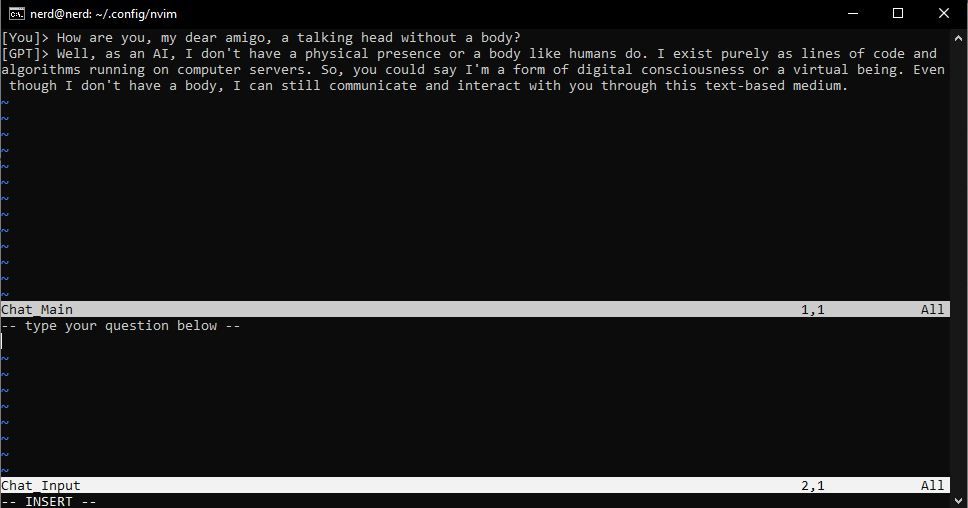

</details>

<details>
<summary>sudo command</summary>

#### ***sudo***

Sudo is a command-line utility that allows users to execute
commands with the privileges of the root user.

#### ***Who can use sudo***

In the first place we should look inside sudoers file.
To check out the sudoers file,
simply type “sudo visudo” and it’ll pop open.
Inside the sudoers file,
you can assign specific sudo permissions to users and groups.
We use a special syntax for this:

[user] [host]=([run as]) [commands]

user: The user who will be granted the permissions.
host: The host on which the user can run commands.
run as: Defines the users as whom the commands can be run.
commands: The specific commands that the user is allowed to run.

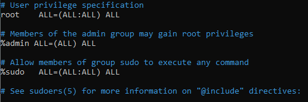

A user can also inherit sudo permissions from the groups he is in.

#### ***Examples***

- `alice ALL=(bob) ALL` — alice can execute any command from bob user on any host.
- `bob ALL=(ALL) NOPASSWD: /usr/bin/apt update` — bob can execute apt update from.
any host and user
- `ALL ALL=(ALL) ALL` — everyone can do whatever they want.
- `edna name_of_specific_host=(edna) ALL` — edna can execute any comand only when
she is login from name_of_specific_host.

</details>

<details>
<summary>Users operations</summary>

#### ***creating users***

##### **useradd**

`useradd [options] <username>`

Some options:

- `-M` — create without a directory.
- `-s` — specify shell.
- `-e` — specify the expire date, when user'll be disabled.
- `-p` — set a password.
- `-u` — set a user ID (UID) manually.
- `-g` — create user and make him a member of specific group
(use group id for that).

Examples:

- `sudo useradd -e 2024-05-30 <username>` — user'll be disabled by the date.
- `sudo useradd -M <username>` — user without home directory.
- `sudo useradd -u 4444 <username>` — user with 4444 UID.
- `sudo useradd -g 27 <username>` — user'll be added to the group with GID 27
(sudo on my machine).

##### **adduser**

`adduser [options] <username>` — friendlier version of useradd,
by default generate password and home directory,
and some additional information about user.

#### ***creating groups***

##### **groupadd**

`groupadd [options] <groupname>`

Some options:

`-g` — create a group with specific GID
`-r` — create a system group

##### **addgroup**

`addgroup [options] <groupname>` — friendlier version of groupadd,
by default choosing Debian policy conformant GID values

#### ***add users to groups***

##### **usermod**

`usermod [options] <username>`

`usermod -aG <groupname> <username>` — add user to the group.

##### **gpasswd**

`gpasswd [options] <username>`

`gpasswd -a <username> <groupname>` — attach user to the group.

#### ***deleting users***

1. `sudo killall -u <username>` — kill all users processes and log him out.
1. `sudo passwd -l <username>` — block user (he can't log in).
1. `crontab -r -u <username>` — stop all system jobs.
1. `id -nG <username>` — check all his groups.
1. `sudo deluser <username> <groups>` — remove him from groups.
1. `sudo userdel -r <username>` — remove user and home directory.

#### ***deleting groups***

`sudo groupdel <groupname>`

#### ***managing users passwords***

- `sudo passwd <username>` — change password for the user.
- `sudo chage -M 90 <username>` — make password periodically (90 days)
changeable for the user.

</details>

<details>
<summary>Aliases</summary>

`alias <alias>='<another_text>'` — create a alias for another text.

`alias vim='nvim'`
`alias neovim='nvim'`

`ln <path_to_file> <path_to_link>` — create an alias for file (symbolic link).

`ln \home\nerd\really_secret\pierogi_recipe.secret \home\nerd\pierogi_link.scrt`

`ln -s <path_to_directory> <path_to_link>` —
create an alias for directory (soft link).

`ln -s secret/really_secret/super_secret/securets shortcut_secret`

</details>

<details>
<summary>Package management</summary>

#### ***YUM***

Distributions: CentOS

Extension: .rpm

Install package: `sudo yum install <package_name>`

Delete package: `sudo yum remove <package_name>`

#### ***RPM***

Distributions: Fedora, openSUSE

Extension: .rpm

Install package: `sudo rpm -i <package_name>`

Delete package: `sudo rpm -e <package_name>`

#### ***APT***

Distributions: Debian-based, Ubuntu

Extension: .deb

Install package: `sudo apt install <package_name>`

Delete package: `sudo apt remove <package_name>`

#### ***APT-GET***

Distributions: Debian-based, Ubuntu

Extension: .deb

Install package: `sudo apt-get install <package_name>`

Delete package: `sudo apt-get remove <package_name>`

#### ***DPKG***

Distributions: Debian-based, Ubuntu

Extension: .deb

Install package: `sudo dpkg -i <package_name>`

Delete package: `sudo dpkg -r <package_name>`

#### ***PACMAN***

Distributions: ArchLinux

Extension: .pkg.tar.xz

Install package: `sudo pacman -S <package_name>`

Delete package: `sudo pacman -R <package_name>`

</details>

<details>
<summary>Compiling from source</summary>

It really depends on exactly what you are trying to compile.
But here are the most common compilation utilities:
cmake, make, gcc, gcc-go, golang-go (or for last two
just `sudo snap install go --classic` instead of apt vesion).

But what I highly recommend is to install docker
(instruction somewhere above)
it makes your life a lot easier,
when you are not depending on the environment,
and also... DOCKER HUB, probably it's the easiest
way to install things, espesially when it's
spiteful and popular enough to be on that hub.

Examples:

- go above and look example with gcc and make
in pam_usb installation.
- go above and look example with docker (dockerhub)
browsh installation.

</details>

<details>
<summary>Space management</summary>

`sudo apt install duf` -> `duf` —
good-looking and intuintive tool, to display space availability

`sudo apt install tree` -> `tree` —
explore directories in tree like architecture.

`sudo apt install mc` -> `mc` —
file manager.

`sudo apt install nnn` -> `nnn` —
better mc.

`sudo apt install ranger` -> `ranger` —
better nnn.

`sudo apt install cargo` -> `export PATH=$PATH:<home_directory>/.cargo/bin`
— rust installer for next few programs.

`cargo install dua-cli` — space visualizer in progess bar style.

`cargo install diskonaut` — space visualizer in treemap style
(like such macroeconomics rectangle graphs).

</details>

<details>
<summary>Drives and partitions</summary>

`umount /dev/sda<number>; resize2fs /dev/sda<number> 200G` —
resize partition sda\<number> to 200G.

`umount /dev/sdb<number>; mkfs.ntfs /dev/sdb<number>` —
change filesystem of partition sdb\<number> to ntfs.

`lvresize -L 20G /dev/vg0/lv-2; resize2fs /dev/vg0/lv-2` —
resize logical volume lv2 to 20G.

</details>

<details>
<summary>Creating ext4 file system and permanently mounting</summary>

#### ***DISCLAIMER***

- We have a drive... yeah, I think it's a pretty cool device.
It cans read bytes, write bytes..., and in simpler terms, that's all.
- If we are incredibly lucky, probably, we have OS on our host.
And if we are the type of person, who likes to sort things up,
we could split our driver to partitions, you know, like add some
partitions to a big box to create smaller boxes.
- Ok, I doubt, that you will write the size and index of the first byte
for each file on the paper. So we will set some filesystems for our partitions.
- Filesystems are very complex animals, to make them work with our OS,
we have to create interface through which OS'll speak with FS.
In other words, we're going to mount it (create a mount point for OS).
(You can imagane it like we give reference for partition FS to our OS FS).

Pretty flimsy construction, don't you think?.. I don't think so either.

#### ***Linuх***

1. `sudo fdisk -l` — list all drives.
1. `sudo fdisk <drive>` — create \<partition> on \<drive>.
1. `sudo mkfs.ext4 <partition>` —
format \<partition> with ext4 filesystem.
1. `sudo mkdir /mnt/<partition_name>` — create a directory in root.
1. `sudo mount <partition> /mnt/<partition_name>` —
mount ext4 filesystem of \<partition> to the directory
(create a `link` to the \<partition> filesystem in the directory).
1. `sudo blkid` — to find \<partition_UUID>.
1. `sudo nano /etc/fstab` — the file with filesystems configs.
1. insert this text to the end of file:
`UUID=<partition_UUID> /mnt/<partition_name> ext4 defaults 0 2` —
so, this line says the following: the mount for the \<partition> FS
is in the directory, it's ext4 FS, 'default' as mount option,
0 - that we don't want backups, and 2 - the number of priority
to load FSs (because we want in the first place load or main FS
without her we can't reach '/mnt/\<partition_name>' directory anyway).

If we do not want mount to be permanently
(to system automaticly load FS for out partition),
we can stop on point 5 including (to do it manually via 'maunt').

</details>

<details>
<summary>Managing logical volumes</summary>

- `sudo pvcreate <partition>` —
intitalize metadata to th partition
(create physical volume).
- `sudo vgcreate <vgroup_name> <physical_volume>` —
create volume group from the physical volume.
- `sudo vgextend <vgroup_name> <another_physical_volume>` —
add new pv to the vg.
- `sudo lvcreate -n <logicalv_name> -L 10G <vgroup_name>` —
create logical volume (some kind of partition) from the vg.
- `sudo mkfs.ext4 <logicalv_name>` —
format the lv with ext4 FS.
- `sudo lvremove <logicalv_name>` —
delete lv.
- `sudo vgremove <vgroup_name>` —
delete vg.

</details>

<details>
<summary>System monitoring</summary>

#### ***tiptop***

So here we will use the best tool for monitoring —
tiptop.

`sudo apt install tiptop` — for installation.

Type `tiptop` and
*...."The Sound of dial-up Internet"....*
~~Mhm.., obviously it's not working well on VM. What the irony with naming~~

#### ***glances***

So here we will use the best tool for monitoring —
glances.

`sudo apt install python3 python3-pip python3-dev;
sudo pip3 install glances;
sudo ln -s /usr/local/bin/glances /usr/bin/glances` — for installation.

Type `glances` and the tool will appear. Press `h` for help.

</details>

</div>

</details>

<details>
<summary>Networking</summary>

<div style="margin-left: 20px;">

<details>
<summary>Network configuration</summary>

Since `network configuration` is a comples topic,
here is just a bunch of random commands:

- `ifconfig` — show the network interfaces.
- `ip a` — very similar to above.
- `route` — show routing table.
- `sudo dhclient -v` — ask dhcp about address.
- `sudo dhclient -v -r` — release the address given from dhcp.
- netstat commands
- `sudo ifconfig <network_adapter> down` — stop the netwrok adapter.
- `sudo ifconfig <network_adapter> up` — start ... .

netplan — is a standart tool to configure network interfaces in ubuntu.
On other machines more traditional is the /etc/networ/interfaces way.
We can access netplan's configuration file by
going to the /etc/netplan directory and open file
with name `00-installer-config.yaml`. For me it contains:

```yaml
# This is the network config written by 'subiquity'
network:
  ethernets:
    enp0s3:
      dhcp4: true
    enp0s8:
      dhcp4: true
    enp0s9:
      dhcp4: true
  version: 2
```

Here we can see our network configuration.
E.g. we can add new interface if that is not here;
delete some existant interface;
make the interface with static ip,
just setting dhcp4 to flase,
and by specify the address and gateway manually:

```yaml
dhcp4: false
addresses:
    -<address1>/<mask>
gateway4: <address2>
```

or specify DNSs:

```yaml
nameservers:
    addresses: [<address3>, <address4>]
```

*I personaly prefer the traditional way of network interfaces.*
~~And if you want too, please read about that by yourself.~~

After changing this .yaml file, use the command `netplan apply`
to make changes work.

</details>

<details>
<summary>SSH service</summary>

Before we begin, INSTALLATION:

`sudo apt-get install openssh-server` — for server.

`sudo apt-get install openssh-server` — for client.

`sudo systemctl enable --now ssh` — to make service work.

#### ***client configuration***

To configure client, please find file: `\etc\ssh\ssh_config`.

Open it with nano(or with something else) and be horrified.
Because we already have all possible configurations with example
values in the comments (god bles the guy who done that).

The most interesting directives (options):

- Port — to change standart ip port for ssh connection to server  `Port 22`.
- ForwardX11 — to make it possible run gui apps on server and send
screen to the host  `ForwardX11 yes`.
- ForwardAgent — to make it possible share secure SSH-Keys with server
  `ForwardAgent`, e.g. to make commits from server to your repository.

`sudo systemctl restart ssh` — restart service to read config with changes.

#### ***server configuration***

To configure client, please find file: `\etc\ssh\sshd_config` (yahoo, daemon).

Open that with text editor.

The most interesting directives (options):

- Port — to change standart ip port for ssh connection to listening  `Port 22`.
- AddressFamily — which kind of ip use 4 or 6   `AddressFamily inet`(for 4).
- UsePAM — define if client can use PAM(Pluggable Authentication Module)
for log in  `UsePAM yes`.
- ClientAliveInterval — how long session of the client will be active
  `ClientAliveInterval 150m`(e.g. 150 minut).
- MaxAuthTries — how many times client can make mistakes while log in process
  `MaxAuthTries 5`.
- MaxSessions — max count of active sessions  `MaxSessions 3`.
- LoginGraceTime — timeout for every mistake while log in
  `LoginGraceTime 1m`.

`sudo systemctl restart ssh` — restart service to read config with changes.

#### ***tunneling***

So what is tunneling in ssh?

I do not know how about You, but i prefer to learn by examples.
Image, that You have server on which the database is running localy on some port,
and You want to access that database.
You have to connect to the server (via ssh) and ask your server
to connect Your host to the database. So, server brings
db port, connect it to your port and you are done.

In other words, when ssh is like phone call,
where phone number is ip of server. Tunneling is more like calling a call center
and being transferred to a specific department.

To achive that use this template:

`ssh -L <local_port>:<localhost>:<remote_port> <user>@<server_ip>`

`ssh -N -L <local_port>:<localhost>:<remote_port> <user>@<server_ip>`
— the same as above but without shell session.

Exm: `ssh -L 33:127.0.0.1:77 sundar@8.8.8.8`

#### ***SCP***

~~SCP(Special Containment Procedures) is a fundation that specialize in~~
~~the containment and study of anomalous creatures or objects to protect mankind.~~

SCP(Secure Copy Protocol) is a protocol which allows you to securely transfer
files between a local host and a remote host.

`scp <host_file> <user>@<server_ip>:<server_where>`
— copy the file from host to the server.

`scp <user>@<server_ip>:<server_file> <host_where>`
— copy the file from server to the host.

</details>

<details>
<summary>NFS service</summary>

~~InSTARr Platinum (a zillion "ORA" output in the shell)~~

#### ***server***

Install server — `sudo apt install nfs-kernel-server`.
`sudo systemctl enable --now nfs-kernel-server` — tunr it on.

`sudo chmod 775 <directory_to_share>` — make share directory accessable.

`sudo nano /etc/exports`
and then add this line:`<directory_to_share> <client_ip>([options])`.
E.g `/ 22.22.22.21(rw,sync,no_subtree_check)`

`sudo systemctl restart nfs-kernel-server` after changes.
And we should have possibility to connect to.

#### ***client***

Install client — `sudo apt install nfs-common`. (Debian-based)

Install client —
enable `Services for NFS` with all subpoints in Windows Featurs. (Windows)

Connection:

TERMiNAL`sudo mount -t nfs <host_ip>:<directory_to_share> <mount_point>`.
To mount shared directory to mount point.

CMD`mount \\<host_ip><directory_to_share> <drive_letter>:`.
E.g. `mount \\8.8.8.8\home Z:`. To mount shared directory to system
(will disappear after reboot).

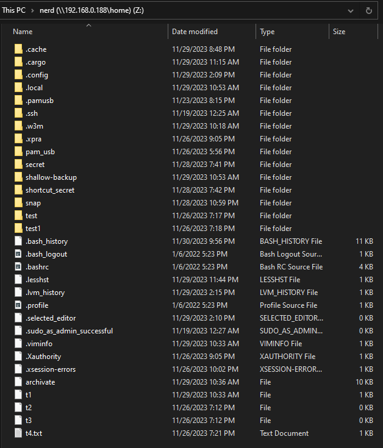

CMD`mount -o persistent=yes \\<host_ip><directory_to_share> <drive_letter>:`.
For permanently mounting.

#### ***fstab***

As metioned in previous topic, we will edit /etc/fstab
to make out mount permanent.

add this line to the file:
`<host_ip>:<directory_to_share> <mount_point> nfs defaults 0 2`.
And from now your system will automaticly mount this shared directory.

</details>

<details>
<summary>File Hosts and hostname</summary>

#### ***Hostname***

Open `/etc/hostname`, it containts your machine name,
which is used to identify your host in network,
also you can find your host name in your "shell cursor":
`<username>@<hostname>:~$<your_command>`

We can change this file and our hostname in "shell cursor"
will also change after reboot.

#### ***Hosts***

Open `/etc/hosts`, here are maps between adresses and names,
like dns. But the hosts file has a higher priority than any DNS servers.
So we can for example, reroute some websites?

Add line `127.0.0.1 www.google.com` to reroute your favorite uncle to localhost.

</details>

<details>
<summary>Configuring interfaces using nmtui</summary>

`sudo apt install network-manager` — to bit-to-bit repair the body of application.

`nmtui` — to start tool. And, oh boy, graphical interface.

We can:

- Set a hostname.
- Activate a connection.
- Edit a connection.

About Editing:

- Add new connection.
- Edit existant connection.
- Delete existant connection.

</details>

<details>
<summary>Firewall</summary>

#### ***iptables***

So, we can set very flexible network rules,
blocking specific traffic, set policy configure
port forwarding, and all of that in the *low-level*
interface of `iptables`.

Because i don't obligate to suffer, we'll not doing that.

#### ***ufw***

`ufw` — user-friendly version of iptables.

Example of usage:

- `sudo ufw enable` — to tunr on.
- `sudo ufw status verbose` — check status.
- `sudo ufw default deny incoming` — ban all connections to your server.
- `sudo ufw default allow outgoing` — allow all connections from server.
- `sudo ufw allow ssh` — to allow ssh.
- `sudo ufw status` — to diplay rules.

</details>

<details>
<summary>Assigning multiple IP addresses to network interfaces</summary>

Why again we want to do that?

*Whisper*.

Mhm, k, lets pretend I don't have schizophrenia.
So, e.g. hosting multiple services or network segregation.

if you want to assign multiple ip addresse:

- Open `/etc/netplan/00-installer-config.yaml`
- Where you have your interface add the addresses, like this:

```yaml
<interface>:
  addresses:
    - <netwrok1>
    - <netwrok2>
```

And now run `sudo netplan generate` — because netplan
is like "userfriendly interface" to configure network on ubuntu system,
we also should somehow change configuration for system network renderer.
So this command will configure this files for us.

Along with `sudo netplan apply` — to apply changes.

In the end — `reboot`.

</details>

<details>
<summary>Monitoring traffic using tcpdump</summary>

Should be already installed.

Typical usage is: `sudo tcpdump -i <interface> [filter]`.

Examples:

- `tcpdump -D` — to display all possible interfaces.
- `sudo tcpdump -i <interface>` — capture all traffic on the `interface`.
- `sudo tcpdump -i <interface> icmp` — capture only `icmp` packets
- `sudo tcpdump -i <interface> src <ip>` — capture traffic from the `source`.
- `sudo tcpdump -i <interface> dst <ip>` — capture traffic to the `destination`.
- `sudo tcpdump -i <interface> port <number>` — capture on the `port`.
- `sudo tcpdump -i <interface> src <ip> and dst port <number>` —
capture traffic from the `ip` and destination on the `port`
- `sudo tcpdump -i <interface> src portrange <smaller_number>-<bigger_number>` —
capture on the range of ports.

</details>

</div>

</details>

<details>
<summary>Remote Access</summary>

<div style="margin-left: 20px;">

<details>
<summary>SSH</summary>

#### ***putty***

**Download:**

1. Go to the [putty main page].
1. Click `Download`.
1. Select the platform you prefere.

**Usage:**

Run application, it should looks +- like that:

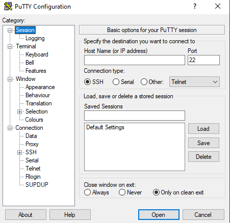

Change the `Port` if it's not default(22).

In the field `Host Name (or IP address)` enter IP address
of the server (or hostname, if you have specified map hostname:address in your
analog of `hosts` file or DNS server). And then press that tantalizing button: `Open`.

You should see this:

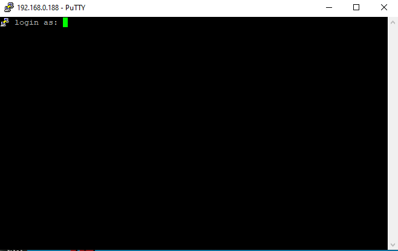

Enter `username` and then `password`.

My congratulations you successfully entered your session.

#### ***mremoteNG***

**Download:**

1. Go to the [mremoteNG main page].
1. Click `Download`.
1. Choose your option.

**Usage:**

Run application, it should looks +- like that:

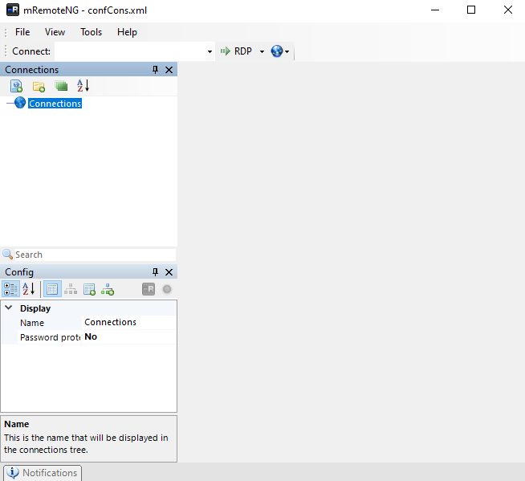

... Ok i can't stand it for such long period.

Naviagte to: `Tools` -> `Options` -> `Theme`.
Make sure checkbox `Enable Themes` have mark.
And choose `dracula` theme. A bunch better.

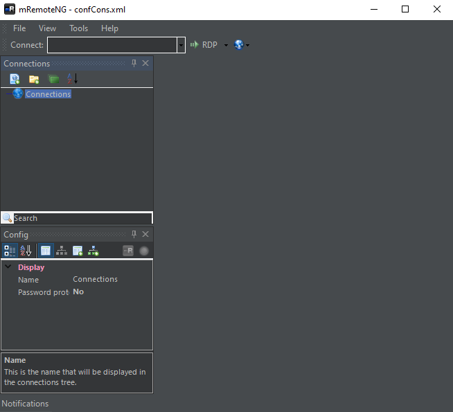

In the `Connections` section click on...
On this little something:


And then configure connection under `Connections` head of tree by clicking on it.
In the appeared menu change: `Protocolo` to SSH v2,
`Port` - change it if you don't use default,
`Hostname/IP` - write the address,
`Username` - enter your username,
`Pssword` - enter your password.
And now we can automaticly connect to the server
(right-click on your connection and `Connect`).

My congratulations you successfully entered your session.

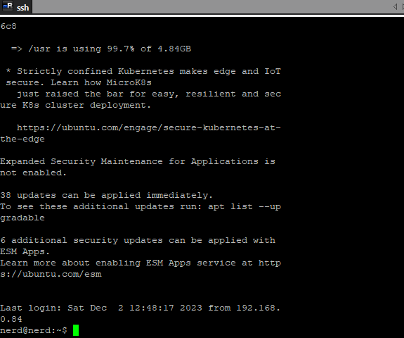

#### ***MobaXtrem***

**Download:**

1. Go to the [MobaXtrem main page].
1. Click `Download`.
1. Choose `Free` version.
1. Choose `Version`, portable ot installer.

**Usage:**

Run application, it should looks +- like that:

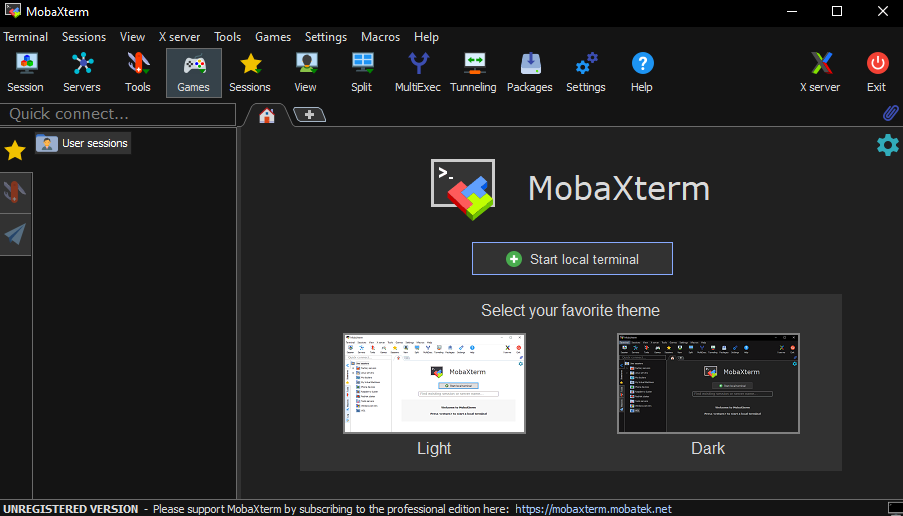

Click on `Sessions` and choose `SSH`.

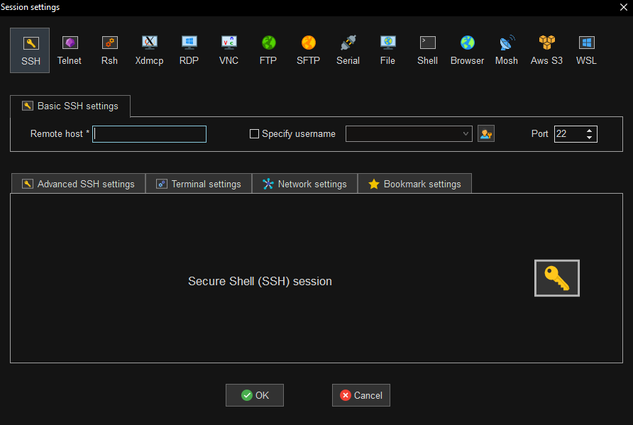

Specify `Port` if it's not standart,
specify `username`,
and obviously how to connect:
per hostname or direclty per address.
Then — `OK`.

And now you only have to enter `password`.

My congratulations you successfully entered your session.

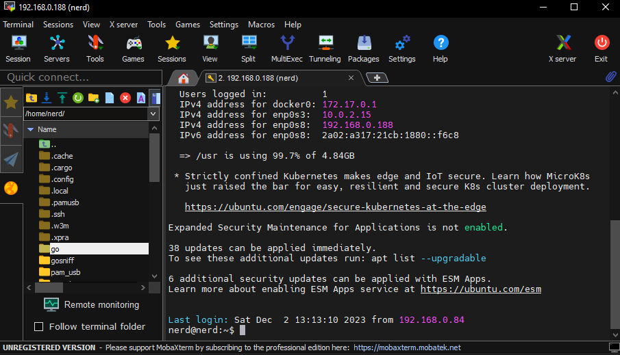

</details>

<details>
<summary>VNC (optional)</summary>

Since optional, then optional.

</details>

</div>

</details>

***

<details>
<summary>Afterface</summary>

That's a sweetie honey - [awesome-cli-apps], that's all you need in cli linux.

Also I took this whole tutorial as an "introductory" guide to linux,
so I wrote it as I took it.

</details>

***

## HeLp

<details>
<summary>HELP! | POMOCY! | ПАМАХИТЕ! | HILFE! | ヘルプ！ | ¡AYÚDAME MI AMIGO!</summary>

### HELP

If you are not familiar with the English.... hold on, why you even reading that then?

### POMOCY

Jeśli nie jesteś zaznajomiony z angielskim, cóż,
użyj [deepl], jest chyba wystarczająco dobry...?

### ПАМАХИТЕ

Они держат меня в этом межгалактическом подвале уже третий день
по каленадрю Юпитера, вызовите бригаду космического десанта [deepl],
они должны знать что делать в таких ситуациях, наверное ...?

### HILFE

Wenn Sie mit der englischen Sprache nicht vertraut sind, verwenden Sie [deepl],
das ist wahrscheinlich gut genug, nehme ich an...?

### ヘルプ

英語に馴染みがなければ、[deepl]を使えばいい。

### AYÚDAME MI AMIGO

¿Si no estás familiarizado con el inglés, bueno, utiliza [deepl],
supongo que te servirá...?

</details>

<!-- ———————————————————————————————————————————————————————————————— -->

[deepl]: <https://www.deepl.com/>
[Ubuntu Server]: <https://ubuntu.com/download/server>
[pam_usb]: <https://github.com/mcdope/pam_usb>
[this prefect video]: <https://www.youtube.com/watch?v=69tzu7YVlx4>
[awesome-cli-apps]: <https://github.com/agarrharr/awesome-cli-apps>
[putty main page]: <https://www.putty.org/>
[MobaXtrem main page]: <https://mobaxterm.mobatek.net/>
[mremoteNG main page]: <https://mremoteng.org/>
